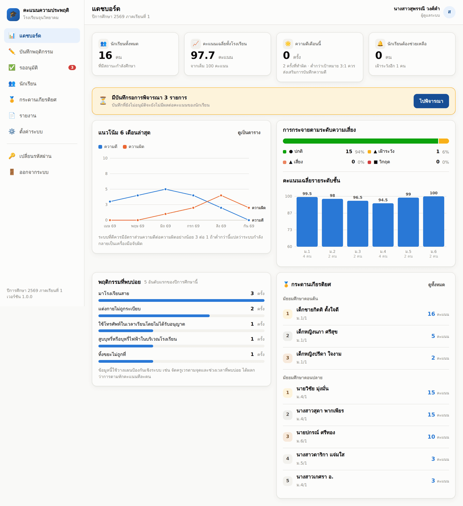
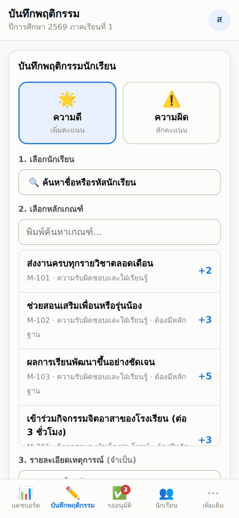
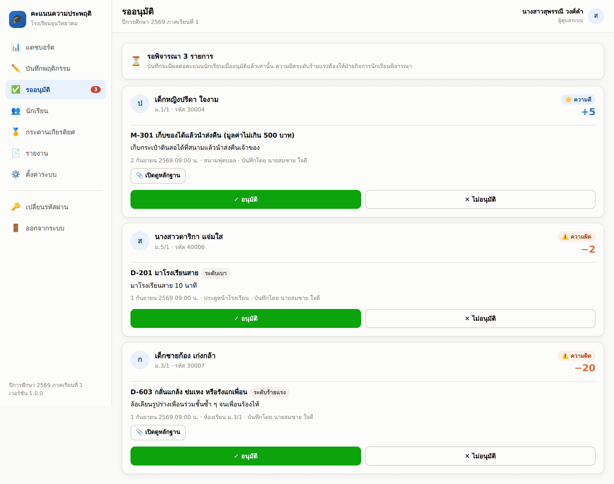
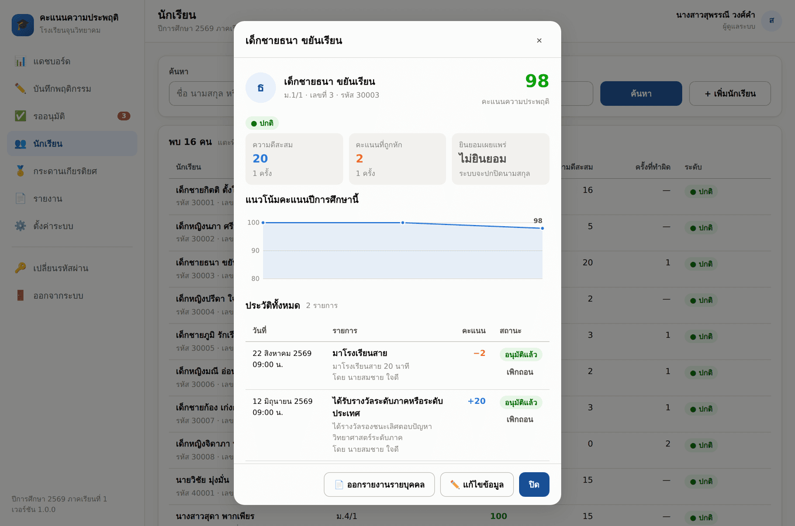
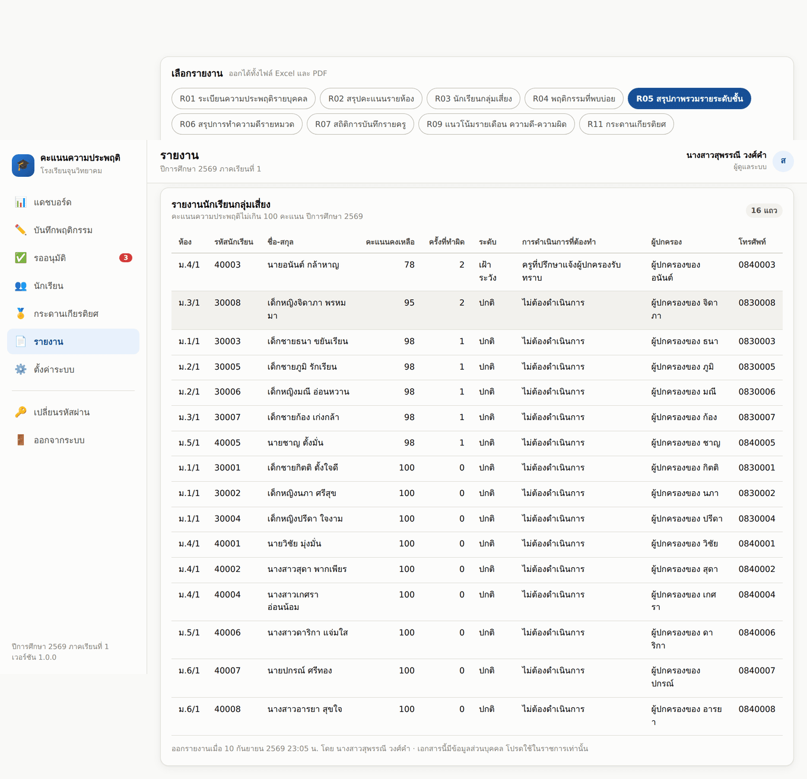
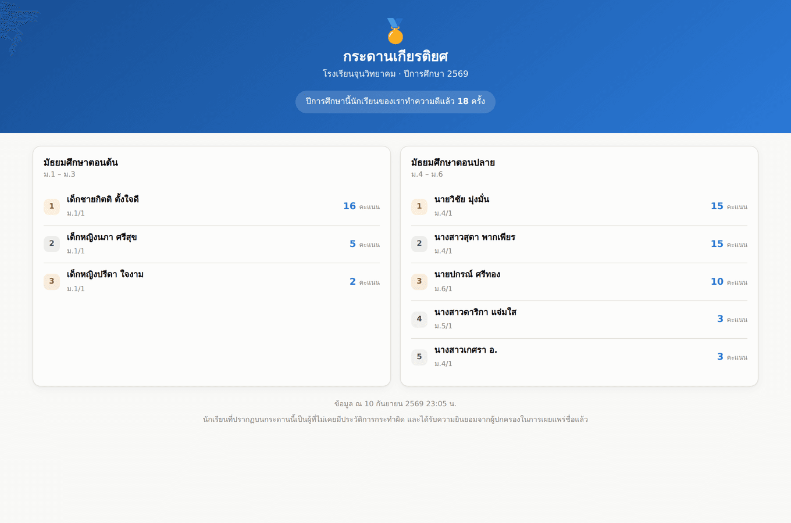
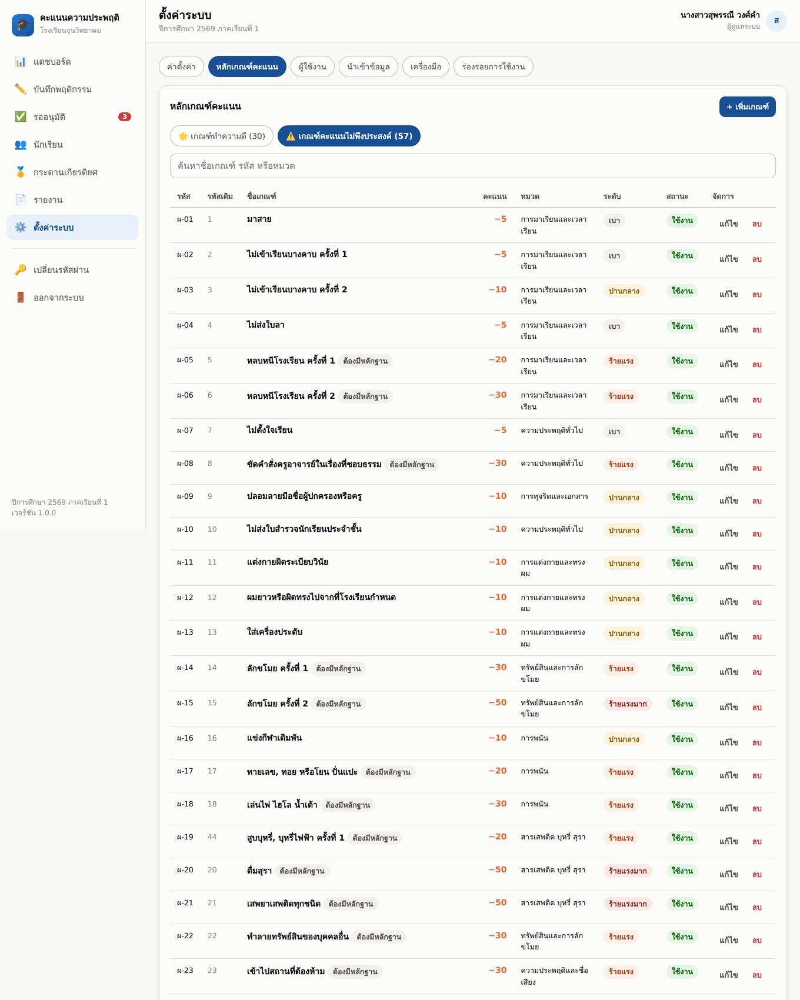
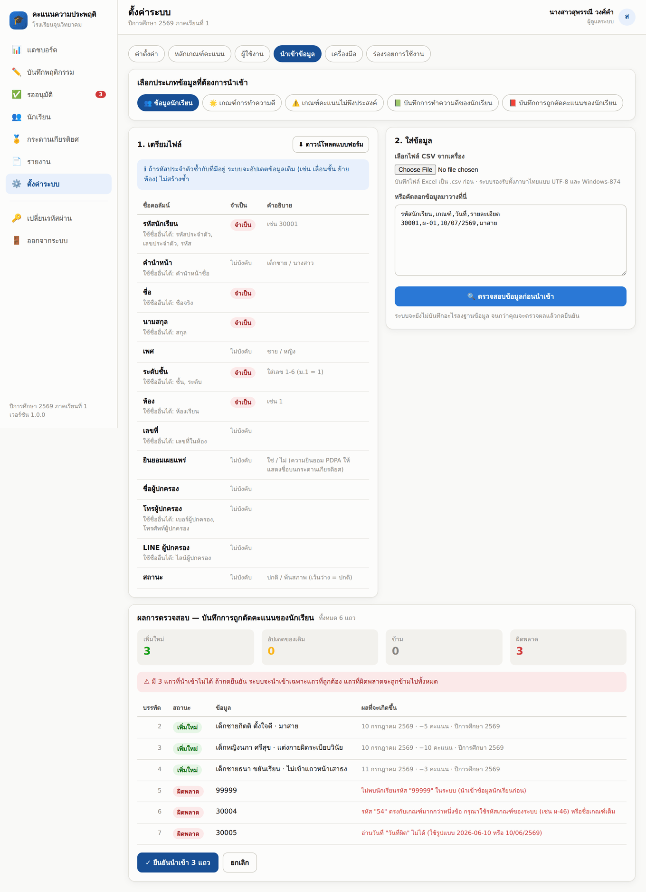

# ระบบจัดเก็บข้อมูลความประพฤตินักเรียน โรงเรียนจุนวิทยาคม
### Student Conduct Scoring System (SCSS)

ระบบบันทึก ติดตาม และรายงานพฤติกรรมนักเรียนด้วย **ระบบคะแนน (Scoring)**
โดยนักเรียนทุกคนได้รับ **คะแนนความประพฤติตั้งต้น 100 คะแนน** เมื่อแรกเข้าในระดับชั้น ม.1 และ ม.4
คะแนนสามารถเพิ่มขึ้นจากการทำความดี และลดลงจากการกระทำผิดตามหลักเกณฑ์ของโรงเรียน

พร้อมกระดานเกียรติยศบนหน้าหลัก แสดง **นักเรียนคะแนนสูงสุด 10 คนต่อระดับ**
(มัธยมศึกษาตอนต้น และตอนปลาย) เฉพาะผู้ที่ **ไม่เคยมีประวัติการกระทำผิด**

> 🚀 **ระบบพร้อมใช้งานจริง — เว็บแอปที่ใช้ Google Sheets เป็นฐานข้อมูล**
> ฟรี ไม่ต้องเช่าโฮสต์ ใช้ได้บนคอมพิวเตอร์ แท็บเล็ต และมือถือ
>
> | | |
> |---|---|
> | ⚡ **ติดตั้งใช้งานจริง** | วางแค่ 3 ไฟล์จาก [`dist/`](dist/) → [ขั้นตอน 15 นาที](dist/README.md) |
> | 🔧 **แก้ไขและดูแลต่อ** | ไฟล์ต้นฉบับแยกโมดูลที่ [`apps-script/`](apps-script/) → [คู่มือเต็ม](apps-script/README.md) |
> | 🧪 **ทดสอบ** | `cd tests && node run.js` → 117 รายการ |

---

## หน้าตาระบบ

| แดชบอร์ด | บันทึกพฤติกรรมบนมือถือ |
|---------|----------------------|
|  |  |

| รออนุมัติ | ประวัตินักเรียนรายบุคคล |
|----------|----------------------|
|  |  |

| รายงาน (ออกได้ทั้ง Excel และ PDF) | กระดานเกียรติยศหน้าเว็บสาธารณะ |
|----------------------------------|-------------------------------|
|  |  |

| จัดการหลักเกณฑ์คะแนน 87 ข้อของโรงเรียน | นำเข้าข้อมูล พร้อมตรวจสอบก่อนยืนยัน |
|----------------------------------------|-------------------------------------|
|  |  |

---

## เอกสารประกอบ

| # | เอกสาร | เนื้อหา |
|---|--------|---------|
| 01 | [ภาพรวมระบบ](docs/01-overview.md) | ขอบเขต ผู้ใช้งาน สถาปัตยกรรม โมดูล |
| 02 | [นโยบายและกลไกคะแนน](docs/02-scoring-policy.md) | บัญชีคะแนน 2 ชุด เกณฑ์เพิ่ม/หัก การกู้คืนคะแนน |
| 03 | [โครงสร้างข้อมูล](docs/03-data-model.md) | ER Diagram คำอธิบายตารางทั้งหมด |
| 04 | [กระดานเกียรติยศหน้าหลัก](docs/04-leaderboard.md) | กติกาการจัดอันดับ เงื่อนไข การป้องกันปัญหา |
| 05 | [กระบวนการทำงานและสิทธิ์](docs/05-workflows.md) | Flow การบันทึก อนุมัติ อุทธรณ์ แจ้งผู้ปกครอง |
| 06 | [ระบบรายงาน](docs/06-reports.md) | รายงาน 14 ประเภท พร้อมผู้รับและรอบการออก |
| 07 | [PDPA และความปลอดภัย](docs/07-privacy-security.md) | ข้อกฎหมาย การยินยอม การปกปิดข้อมูล |
| 08 | [ข้อเสนอแนะและแผนพัฒนา](docs/08-roadmap.md) | สิ่งที่ควรทำต่อ 4 เฟส + ประเด็นที่ต้องตัดสินใจ |
| 09 | [หลักเกณฑ์คะแนนของโรงเรียน](docs/09-school-criteria.md) | เกณฑ์จริง 87 ข้อ + ข้อสังเกตเชิงนโยบายที่ควรทบทวน |

## เว็บแอปที่ใช้งานได้จริง

```
apps-script/
├── README.md           คู่มือติดตั้งทีละขั้น สำหรับครูคอมพิวเตอร์ของโรงเรียน
├── 00_Config.gs        ค่าคงที่ โครงสร้างชีต บทบาทและตารางสิทธิ์
├── 01_Db.gs            ชั้นเข้าถึงข้อมูล Google Sheets
├── 02_Auth.gs          ล็อกอิน เซสชัน สิทธิ์การใช้งาน
├── 03_Scoring.gs       กลไกคะแนน 2 บัญชี และกระดานเกียรติยศ
├── 04_Api.gs           API 28 ตัวที่หน้าเว็บเรียกใช้
├── 05_Reports.gs       รายงาน 9 ประเภท ส่งออก Excel และ PDF
├── 06_Setup.gs         ติดตั้งระบบ เมนูใน Google Sheets ข้อมูลตัวอย่าง
├── 07_WebApp.gs        จุดเข้าเว็บแอปและ API สาธารณะ
├── 08_RuleData.gs      หลักเกณฑ์จริงของโรงเรียน 87 ข้อ
├── 09_Import.gs        ระบบนำเข้าข้อมูล 5 ประเภท พร้อมตรวจสอบก่อนยืนยัน
└── *.html              หน้าเว็บทั้งหมด (รองรับมือถือและโหมดมืด)

dist/                   ไฟล์รวมสำหรับติดตั้ง (Code.gs + Index.html + appsscript.json)
build/bundle.js         ตัวรวมไฟล์ — รัน node build/bundle.js หลังแก้ไขต้นฉบับทุกครั้ง
```

**นำเข้าข้อมูลได้ 5 ประเภท** — ข้อมูลนักเรียน · เกณฑ์การทำความดี · เกณฑ์คะแนนไม่พึงประสงค์ ·
บันทึกการทำความดี · บันทึกการถูกตัดคะแนน
ทุกครั้งจะ **ตรวจสอบให้ดูก่อนว่าแถวไหนจะเพิ่ม แถวไหนอัปเดต แถวไหนผิดและผิดเพราะอะไร**
แล้วจึงค่อยกดยืนยัน · รองรับวันที่ พ.ศ. และไฟล์ CSV ภาษาไทยจาก Excel (Windows-874)

ระบบนี้ใช้กติกาคะแนนชุดเดียวกับที่ออกแบบไว้ในเอกสาร ผ่านการทดสอบตรรกะฝั่งเซิร์ฟเวอร์ 117 รายการ
ครอบคลุมการเข้าสู่ระบบ สิทธิ์ตามบทบาท กลไกคะแนน เพดาน 100 การเพิกถอน เงื่อนไขกระดานเกียรติยศ
การปกปิดชื่อตาม PDPA การนำเข้าข้อมูลทั้ง 5 ประเภท และการออกรายงาน

## โครงสร้างฐานข้อมูลสำหรับขยายเป็นระบบใหญ่ (PostgreSQL)

เมื่อนักเรียนเกิน 3,000 คน หรือต้องเชื่อมกับระบบอื่นของโรงเรียน ย้ายจาก Sheets มาที่นี่ได้

```
db/
├── schema.sql              โครงสร้างตารางทั้งหมด (PostgreSQL 14+)
├── seed_reference.sql      ข้อมูลตั้งต้น: บทบาท ประเภทเกณฑ์ ค่าตั้งค่าระบบ
├── seed_rules.sql          ตัวอย่างหลักเกณฑ์คะแนนความดี/คะแนนความผิด
├── seed_demo.sql           ข้อมูลตัวอย่างสำหรับทดสอบ (นักเรียน 8 คน + บันทึก 15 รายการ)
└── queries/
    ├── leaderboard.sql     คิวรีกระดานเกียรติยศหน้าหลัก
    └── reports.sql         คิวรีรายงานหลัก 10 ชุด
```

ทดสอบ:

```bash
createdb scss
psql -d scss -f db/schema.sql
psql -d scss -f db/seed_reference.sql
psql -d scss -f db/seed_rules.sql
psql -d scss -f db/queries/leaderboard.sql
psql -d scss -f db/seed_demo.sql          # ข้อมูลตัวอย่าง (ข้ามได้ถ้าใช้จริง)

# ดูกระดานเกียรติยศ
psql -d scss -c "SELECT * FROM fn_leaderboard();"
```

## หลักการออกแบบสำคัญ 3 ข้อ

1. **แยกบัญชีคะแนนเป็น 2 ชุด** — *คะแนนความประพฤติ* (เพดาน 100 ใช้ตัดสินทางวินัย)
   และ *คะแนนความดีสะสม* (ไม่มีเพดาน ใช้จัดอันดับและยกย่อง)
   เพื่อไม่ให้นักเรียนที่สะสมความดีไว้มาก "มีเครดิต" ไปกลบความผิดร้ายแรง
2. **บัญชีคะแนนเป็นแบบ Append-only Ledger** — ทุกการเปลี่ยนแปลงคะแนนเป็นรายการที่ลบไม่ได้
   ตรวจสอบย้อนหลังได้ทุกคะแนน ใครให้ เมื่อไร ด้วยเหตุใด
3. **ทุกการหักคะแนนต้องผ่านการอนุมัติและอุทธรณ์ได้** — เพราะเป็นข้อมูลที่กระทบสิทธิเด็ก
   ต้องสอดคล้องระเบียบกระทรวงศึกษาธิการว่าด้วยการลงโทษนักเรียนและนักศึกษา พ.ศ. 2548 และ PDPA
