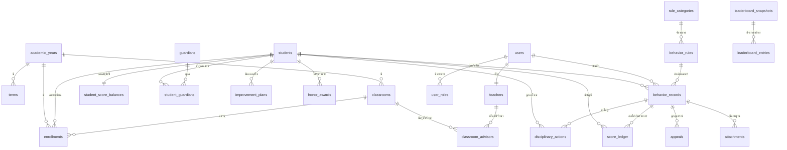

# 03 โครงสร้างข้อมูล

ไฟล์จริง: [`db/schema.sql`](../db/schema.sql) — ทดสอบโหลดบน PostgreSQL 16 ผ่านแล้ว

## 3.1 แผนผังความสัมพันธ์ (ER Diagram)



## 3.2 ตารางทั้งหมด (28 ตาราง)

### กลุ่ม A — ข้อมูลอ้างอิงและตั้งค่า

| ตาราง | หน้าที่ | จุดที่ควรรู้ |
|-------|--------|-------------|
| `academic_years` | ปีการศึกษา | มี partial unique index บังคับให้มีปีปัจจุบันได้ปีเดียว |
| `terms` | ภาคเรียน | ใช้คุมเพดานคะแนนความดีต่อภาคเรียน |
| `app_settings` | ค่าตั้งค่าทั้งระบบ (jsonb) | คะแนนตั้งต้น เพดาน กติกากระดาน — **ห้าม hard-code ในโปรแกรม** |
| `score_thresholds` | เกณฑ์คะแนน → ระดับเสี่ยง → การดำเนินการ | โรงเรียนแก้เกณฑ์ได้เองโดยไม่ต้องแก้โค้ด |

### กลุ่ม B — คน

| ตาราง | หน้าที่ | จุดที่ควรรู้ |
|-------|--------|-------------|
| `users`, `roles`, `user_roles` | บัญชีผู้ใช้และสิทธิ์ | `user_roles.scope` เป็น jsonb เก็บขอบเขต เช่น ครูที่ปรึกษาเห็นเฉพาะห้องตน |
| `teachers` | ข้อมูลครู | แยกจาก `users` เพราะครูอาจไม่มีบัญชีระบบ |
| `students` | ข้อมูลนักเรียน | เก็บเลขบัตร ปชช. แบบเข้ารหัส และ flag ความยินยอม PDPA |
| `guardians`, `student_guardians` | ผู้ปกครอง | นักเรียน 1 คนมีผู้ปกครองได้หลายคน มี `is_primary` |
| `classrooms`, `classroom_advisors`, `enrollments` | ห้องเรียนรายปี | นักเรียน 1 คน = 1 ห้อง ต่อ 1 ปีการศึกษา (บังคับด้วย unique) |

**เหตุผลที่แยก `students` ออกจาก `enrollments`**
นักเรียนอยู่กับโรงเรียน 3 ปีและเปลี่ยนห้องทุกปี ถ้าเก็บ `grade_level` ไว้ในตาราง `students`
พอขึ้นชั้นแล้วแก้ค่า ประวัติเดิมจะเพี้ยนทันที (บันทึกตอน ม.1 จะกลายเป็นบันทึกของ ม.2)
โครงสร้างนี้ทำให้ย้อนดูได้เสมอว่า *ตอนเกิดเหตุ นักเรียนอยู่ห้องไหน*

### กลุ่ม C — กติกาและบันทึก

| ตาราง | หน้าที่ | จุดที่ควรรู้ |
|-------|--------|-------------|
| `rule_categories` | หมวดหมู่เกณฑ์ | ใช้จัดกลุ่มในรายงาน |
| `behavior_rules` | หลักเกณฑ์เพิ่ม/หักคะแนน | **มีเวอร์ชัน** ระเบียบเปลี่ยนได้ แต่บันทึกเก่าต้องอ้างเกณฑ์เดิม |
| `behavior_records` | บันทึกเหตุการณ์ (ตารางแกนกลาง) | เก็บ `points` เป็น snapshot ไม่พึ่งค่าปัจจุบันของกติกา |
| `attachments` | ไฟล์หลักฐาน | เก็บ sha256 ตรวจสอบว่าไฟล์ไม่ถูกแก้ |

**เหตุผลที่ต้อง snapshot `points` ลงในบันทึก**
ถ้าปีหน้าโรงเรียนเปลี่ยน "มาสาย" จาก 2 เป็น 5 คะแนน ประวัติเก่าต้องยังแสดง 2 คะแนนเหมือนเดิม
ไม่เช่นนั้นคะแนนคงเหลือของนักเรียนจะเปลี่ยนย้อนหลังโดยไม่มีใครสั่ง

### กลุ่ม D — บัญชีคะแนน

| ตาราง | หน้าที่ | จุดที่ควรรู้ |
|-------|--------|-------------|
| `score_ledger` | บัญชีเดินคะแนนแบบ **append-only** | มี trigger ห้าม UPDATE/DELETE เด็ดขาด |
| `student_score_balances` | ยอดคงเหลือรายปี | ค่าที่คำนวณแล้ว (denormalized) เพื่อความเร็ว |

`score_ledger` คือ "แหล่งความจริง" ทุกคะแนนตอบได้ว่า *ใครให้ เมื่อไร ด้วยเหตุใด อ้างบันทึกใด*
ส่วน `student_score_balances` เป็นเพียงยอดสรุป สร้างใหม่จาก ledger ได้เสมอ
ถ้าสงสัยว่ายอดผิด ให้ตรวจสอบด้วย

```sql
SELECT student_id, SUM(points_delta)
FROM score_ledger WHERE account = 'conduct' GROUP BY student_id;
```

### กลุ่ม E — การดำเนินการทางวินัย

| ตาราง | หน้าที่ |
|-------|--------|
| `disciplinary_actions` | คำสั่งลงโทษ 4 ประเภทตามระเบียบ ศธ. พ.ศ. 2548 พร้อมการรับทราบของผู้ปกครอง |
| `improvement_plans` | แผนปรับเปลี่ยนพฤติกรรมและการกู้คืนคะแนน |
| `appeals` | การอุทธรณ์ พร้อมผลการพิจารณา (ยืนตาม/ลดโทษ/เพิกถอน) |
| `notifications` | คิวการแจ้งเตือน LINE/อีเมล/ในระบบ |

### กลุ่ม F — การเผยแพร่และตรวจสอบ

| ตาราง | หน้าที่ | จุดที่ควรรู้ |
|-------|--------|-------------|
| `leaderboard_snapshots` + `leaderboard_entries` | สแนปช็อตอันดับที่ประกาศ | เก็บ `criteria` ของวันนั้นไว้ด้วย ตอบข้อโต้แย้งย้อนหลังได้ |
| `honor_awards` | เกียรติบัตร/รางวัล | ออกเลขที่เกียรติบัตรได้ |
| `audit_logs` | ร่องรอยทุกการกระทำ | เก็บค่าเดิม/ค่าใหม่ เป็น jsonb |

## 3.3 ฟังก์ชันสำคัญในฐานข้อมูล

| ฟังก์ชัน | หน้าที่ |
|----------|--------|
| `fn_ensure_balance(student, year)` | สร้างยอดตั้งต้น 100 คะแนน (idempotent) |
| `fn_post_behavior_record(record_id)` | ลงบัญชีคะแนนเมื่อบันทึกได้รับอนุมัติ (จัดการเพดาน 100 ให้เอง) |
| `fn_reverse_behavior_record(id, เหตุผล)` | กลับรายการเมื่อเพิกถอน/อุทธรณ์สำเร็จ |
| `fn_refresh_risk_level(student, year)` | ปรับระดับความเสี่ยงตาม `score_thresholds` |
| `fn_leaderboard(band, limit)` | คำนวณอันดับสด |
| `fn_build_leaderboard_snapshot(type, key)` | สร้างสแนปช็อตอันดับสำหรับหน้าเว็บสาธารณะ |
| `level_band(grade)` | แปลง ม.1-3 → `lower`, ม.4-6 → `upper` |
| `public_display_name(...)` | ปกปิดนามสกุลถ้าไม่มีความยินยอม PDPA |

ทั้งหมดผูกกับ trigger `behavior_record_status_change` — เมื่อสถานะบันทึกเปลี่ยนเป็น `approved`
คะแนนจะเดินอัตโนมัติ ไม่ต้องพึ่งให้โปรแกรมฝั่งแอปเรียกเอง ป้องกันข้อมูลไม่ตรงกันเมื่อมีหลายช่องทางเข้าถึง

## 3.4 มุมมอง (View) ที่ใช้บ่อย

- `v_student_current` — นักเรียน + ห้อง + คะแนนของปีการศึกษาปัจจุบัน (ใช้ในเกือบทุกรายงาน)
- `v_student_lifetime_conduct` — สถิติสะสมตลอดชีวิตการเป็นนักเรียน ใช้คัดกรอง "ไม่เคยกระทำผิด"
