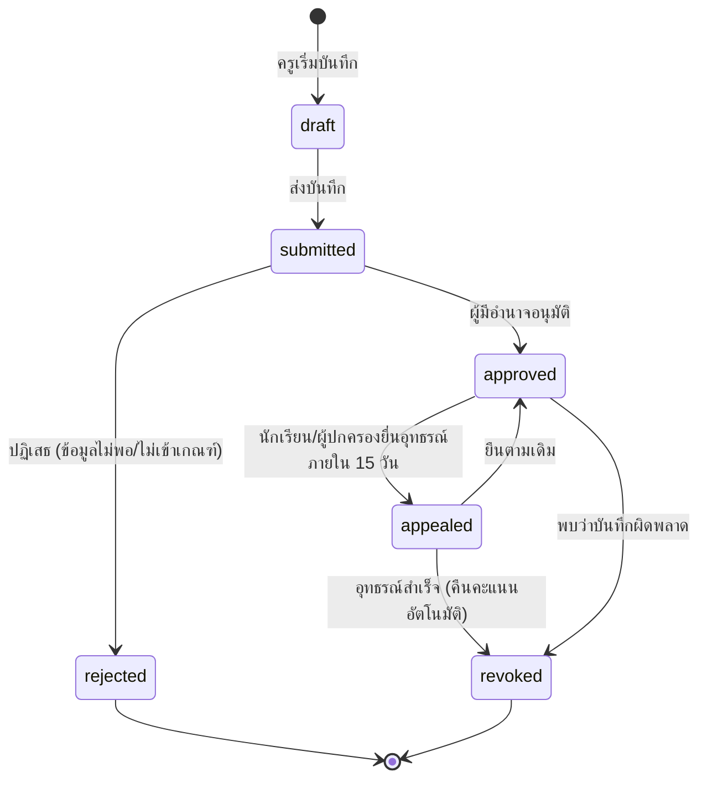

# 05 กระบวนการทำงาน

## 5.1 วงจรชีวิตของบันทึกพฤติกรรม



**จุดที่คะแนนเดิน**: เฉพาะตอนเข้าสถานะ `approved` เท่านั้น
และตอนออกจาก `approved` ไป `revoked` ระบบจะลงรายการกลับให้อัตโนมัติผ่าน trigger
ทำให้เป็นไปไม่ได้ที่คะแนนจะเดินโดยไม่มีบันทึกรองรับ

**ใครอนุมัติได้**

| ประเภทบันทึก | ผู้อนุมัติ |
|-------------|-----------|
| ความดี ≤ 5 คะแนน | ครูที่ปรึกษา |
| ความดี > 5 คะแนน | หัวหน้าระดับชั้น |
| ความผิด severity 1–2 | ครูที่ปรึกษา หรือ หัวหน้าระดับชั้น |
| ความผิด severity 3–4 | ฝ่ายกิจการนักเรียนเท่านั้น |

## 5.2 ขั้นตอนหลักในการใช้งานจริง

### ก. ครูบันทึกพฤติกรรม (ควรใช้เวลาไม่เกิน 30 วินาที)

```
เปิดแอปมือถือ → สแกน QR บนบัตรนักเรียน (หรือค้นจากชื่อ/รหัส)
   → เลือกเกณฑ์จากรายการ (คะแนนเติมให้อัตโนมัติ)
   → พิมพ์รายละเอียด / ถ่ายรูปหลักฐาน → ส่ง
```

> **สำคัญที่สุดต่อความสำเร็จของโครงการ** ถ้าการบันทึกใช้เวลาเกิน 1 นาที
> ครูจะเลิกใช้ภายใน 2 สัปดาห์ แล้วระบบจะมีข้อมูลไม่ครบจนใช้งานไม่ได้
> ต้องลงทุนกับความเร็วของหน้าจอบันทึกมากกว่าฟีเจอร์อื่นทั้งหมด

### ข. การอนุมัติ

ผู้อนุมัติเห็นรายการรออนุมัติในหน้าแรก (index `behavior_records_pending_idx` รองรับไว้แล้ว)
อนุมัติทีละหลายรายการได้ และต้องระบุเหตุผลเมื่อปฏิเสธ

### ค. การแจ้งเตือนอัตโนมัติ

| เหตุการณ์ | ผู้รับ | ช่องทาง |
|-----------|--------|---------|
| บันทึกความดีได้รับอนุมัติ | ผู้ปกครอง + นักเรียน | LINE |
| บันทึกความผิดได้รับอนุมัติ | ผู้ปกครอง + นักเรียน + ครูที่ปรึกษา | LINE + ในระบบ |
| คะแนนตกข้ามเกณฑ์ | ตาม `score_thresholds.notify_roles` | LINE + ในระบบ |
| มีบันทึกรออนุมัติเกิน 3 วัน | ผู้อนุมัติ | ในระบบ |
| ติด 10 อันดับกระดานเกียรติยศ | ผู้ปกครอง + นักเรียน | LINE |
| ครบกำหนดแผนปรับพฤติกรรม | นักเรียน + ครูผู้ควบคุม | LINE |

> **ข้อควรระวัง** การแจ้ง "หักคะแนน" ทาง LINE ต้องใช้ถ้อยคำที่สร้างสรรค์
> เช่น "วันนี้ธนามาโรงเรียนสาย 20 นาที ครูที่ปรึกษายินดีพูดคุยหากมีอุปสรรค"
> ไม่ใช่ "ธนาถูกตัด 2 คะแนน" ระบบควรเก็บข้อความเป็นเทมเพลตที่โรงเรียนแก้ไขได้

### ง. การอุทธรณ์

```
นักเรียน/ผู้ปกครองยื่นอุทธรณ์ (ภายใน 15 วันนับจากอนุมัติ)
   → ฝ่ายกิจการนักเรียนรับเรื่อง → สอบข้อเท็จจริง
   → ผลการพิจารณา 3 ทาง: ยืนตามเดิม / ลดคะแนน / เพิกถอน
   → กรณีเพิกถอน ระบบคืนคะแนนและลบออกจากประวัติที่กระทบสิทธิ์ทันที
```

การมีช่องทางอุทธรณ์ไม่ใช่แค่ความเป็นธรรม แต่เป็นเกราะป้องกันโรงเรียนด้วย
เมื่อผู้ปกครองร้องเรียน โรงเรียนแสดงได้ว่ามีกระบวนการที่ตรวจสอบได้

### จ. งานประจำต้นปีการศึกษา

```
1. สร้างปีการศึกษาใหม่ + ภาคเรียน       (ผู้ดูแลระบบ)
2. สร้างห้องเรียน + กำหนดครูที่ปรึกษา
3. นำเข้ารายชื่อนักเรียน ม.1/ม.4 (CSV จาก DMC)
4. เลื่อนชั้นนักเรียนเดิม + จัดห้องใหม่
5. รัน fn_ensure_balance ให้นักเรียนใหม่ทุกคน (ได้ 100 คะแนน)
6. ทบทวนหลักเกณฑ์คะแนน — ถ้าแก้ ให้สร้าง version ใหม่ ห้ามแก้ทับของเดิม
7. เก็บแบบยินยอม PDPA จากผู้ปกครองพร้อมเอกสารมอบตัว
```

## 5.3 เมทริกซ์สิทธิ์การเข้าถึงข้อมูล

| ข้อมูล | นักเรียน | ผู้ปกครอง | ครูผู้สอน | ครูที่ปรึกษา | หัวหน้าระดับ | กิจการนักเรียน | ผู้บริหาร |
|--------|---------|----------|----------|------------|------------|--------------|----------|
| คะแนนตนเอง/บุตรหลาน | ✅ | ✅ | – | – | – | – | – |
| คะแนนนักเรียนในห้องที่ปรึกษา | ❌ | ❌ | ❌ | ✅ | ✅ | ✅ | ✅ |
| คะแนนนักเรียนทั้งโรงเรียน | ❌ | ❌ | ❌ | ❌ | ระดับตน | ✅ | ✅ |
| บันทึกที่ตนเองสร้าง | ❌ | ❌ | ✅ | ✅ | ✅ | ✅ | ✅ |
| ไฟล์หลักฐาน | เฉพาะของตน | เฉพาะบุตรหลาน | เฉพาะที่ตนแนบ | ✅ | ✅ | ✅ | ❌ |
| อนุมัติบันทึก | ❌ | ❌ | ❌ | บางส่วน | ✅ | ✅ | ❌ |
| ออกรายงานรายบุคคล | ตนเอง | บุตรหลาน | ❌ | ห้องตน | ระดับตน | ✅ | ✅ |
| แก้ไขหลักเกณฑ์ | ❌ | ❌ | ❌ | ❌ | ❌ | เสนอ | อนุมัติ |
| ดู audit log | ❌ | ❌ | ❌ | ❌ | ❌ | ❌ | ✅ (ร่วมกับผู้ดูแลระบบ) |

> ผู้บริหารตั้งใจให้ **ไม่เห็นไฟล์หลักฐาน** เป็นค่าตั้งต้น เพราะมักมีภาพถ่ายนักเรียน
> ซึ่งเป็นข้อมูลอ่อนไหว ควรจำกัดผู้เข้าถึงเท่าที่จำเป็นตามหลัก data minimization ของ PDPA
